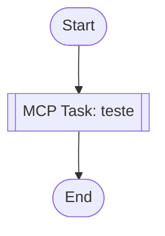

# my-workflow

## Workflow Diagram



## Execution Instructions

## Workflow Execution Guide

Follow the Mermaid flowchart above to execute the workflow. Each node type has specific execution methods as described below.

### Execution Methods by Node Type

- **Rectangle nodes (Sub-Agent: ...)**: Execute Sub-Agents
- **Diamond nodes (AskUserQuestion:...)**: Prompt the user with a question and branch based on their response
- **Diamond nodes (Branch/Switch:...)**: Automatically branch based on the results of previous processing (see details section)
- **Rectangle nodes (Prompt nodes)**: Execute the prompts described in the details section below

## MCP Tool Nodes

#### mcp-1774195168993(MCP Auto-Selection) - AI Tool Selection Mode

<!-- MCP_NODE_METADATA: {"mode":"aiToolSelection","serverId":"agentes-24h-local-orchestrator","userIntent":"teste"} -->

**MCP Server**: agentes-24h-local-orchestrator

**Validation Status**: valid

**User Intent (Natural Language Task Description)**:

```
teste
```

**Execution Method**:

Antigravity should analyze the task description above and query the MCP server "agentes-24h-local-orchestrator" at runtime to get the current list of tools. Then, select the most appropriate tool and determine the appropriate parameter values based on the task requirements.
